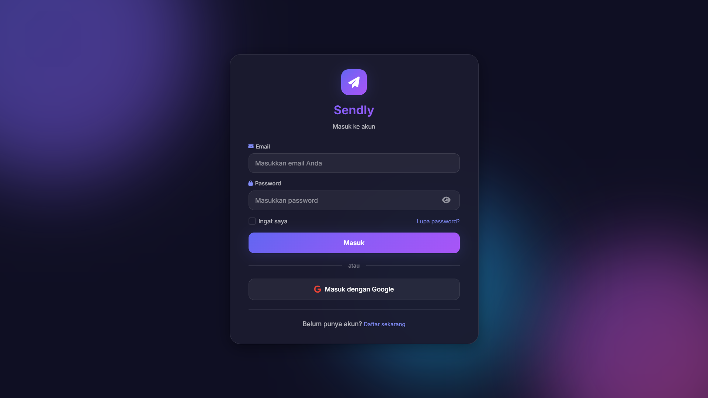
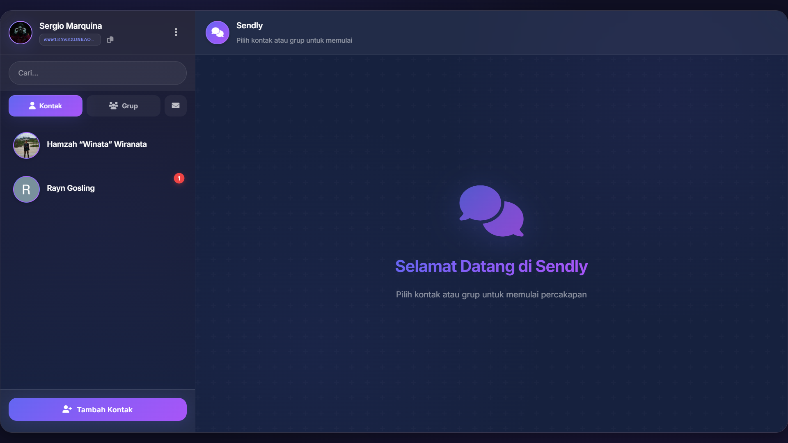
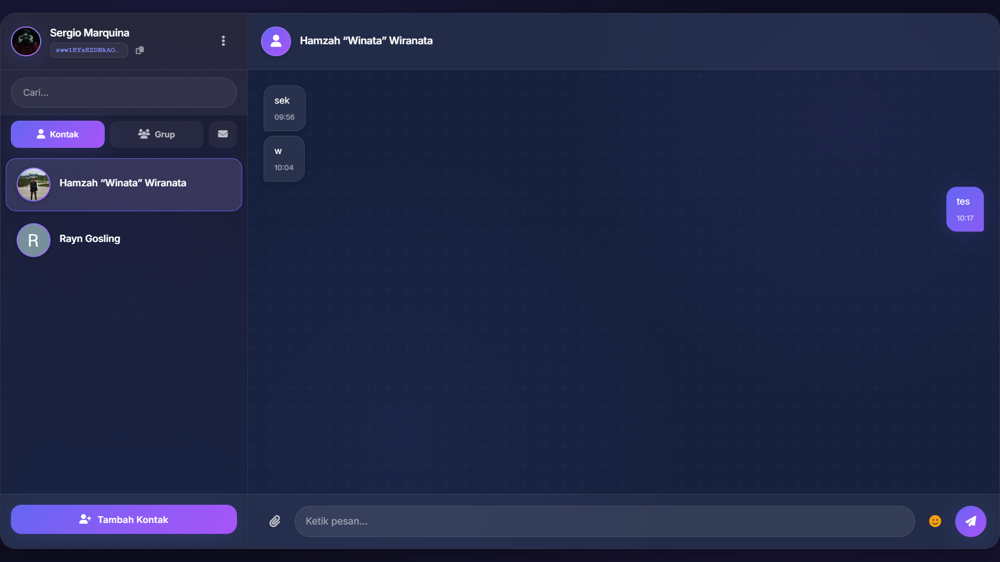
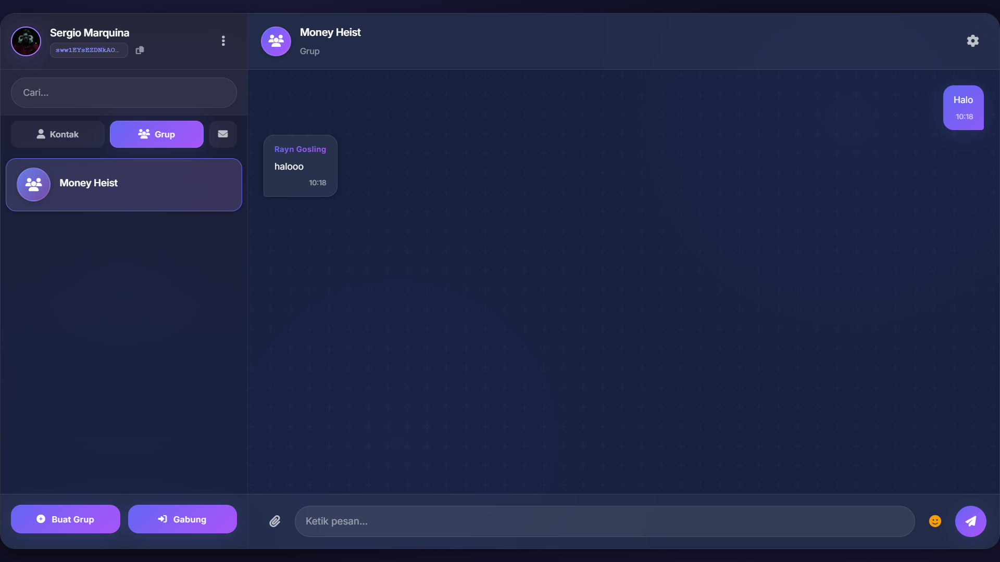
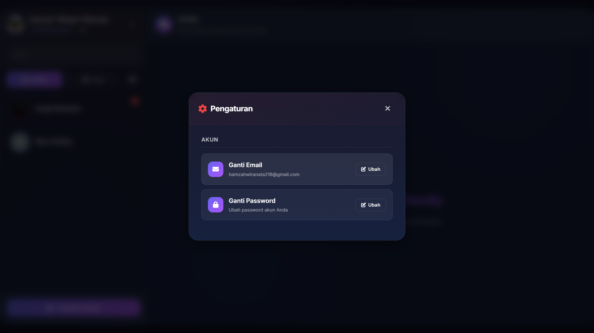
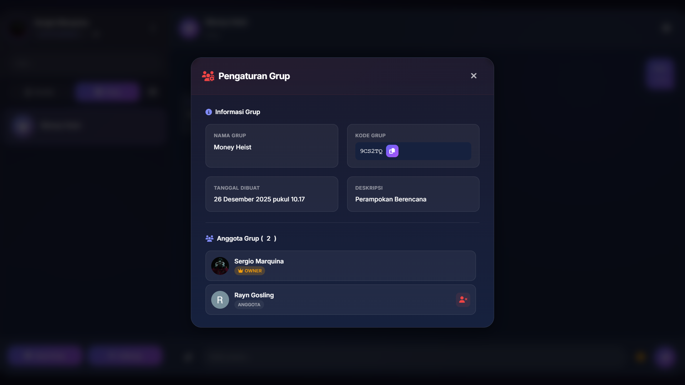

# Sendly - Chat Application

Aplikasi chat modern dengan fitur real-time messaging, chat personal dan grup, serta sistem kode unik.

## 📸 Screenshots

### Halaman Login


### Halaman Register


### Interface Chat Utama


### Chat Personal


### Chat Grup


### Manajemen Akun


### Manajemen Grup


## ✨ Fitur Utama

### 💬 Chat Real-Time
- Instant messaging dengan Firebase
- Chat personal (1-on-1)
- Chat grup dengan multiple members
- Message status (sent, delivered, read)
- Typing indicator

### 👥 Manajemen Kontak & Grup
- Tambah kontak via kode unik
- Buat grup baru
- Join grup via kode unik
- List kontak dan grup terpisah
- Pencarian kontak dan grup

### 📎 File Sharing
- Upload gambar dan file
- Preview gambar sebelum kirim
- Download file yang diterima
- Batas ukuran 10MB

### 🎨 UI/UX Modern
- Dark theme dengan glassmorphism
- Gradient colors (Purple-Blue)
- Responsive design
- Smooth animations
- Toast notifications

## 🚀 Quick Start

### Prasyarat
- PHP 8.0+
- XAMPP/LAMP
- Firebase Account

### Setup Firebase
1. Buat project di [Firebase Console](https://console.firebase.google.com/)
2. Enable Realtime Database
3. Enable Storage
4. Copy config ke `public/firebase-config.js`

### Setup Aplikasi
1. Clone repository
2. Update Firebase config
3. Start Apache di XAMPP
4. Akses `http://localhost/Website-Platform/public`

## 🛠️ Tech Stack

- **Frontend**: HTML5, CSS3, JavaScript
- **Backend**: PHP 8.0+
- **Database**: Firebase Realtime Database
- **Storage**: Firebase Storage
- **UI**: Glassmorphism design

## 📝 Cara Menggunakan

1. **Dapatkan Kode User**: Setiap user dapat kode unik otomatis
2. **Tambah Kontak**: Gunakan kode unik untuk tambah kontak
3. **Buat Grup**: Buat grup dan bagikan kode untuk join
4. **Kirim Pesan**: Chat real-time dengan emoji dan file
5. **Upload File**: Kirim gambar/dokumen dengan preview

## 📄 License

MIT License


## 📸 Cara Menambahkan Screenshots

Untuk menambahkan screenshots aplikasi ke README:

1. **Ambil Screenshot** dari berbagai halaman aplikasi:
   - Halaman login (`login.png`)
   - Halaman register (`register.png`)
   - Interface chat utama (`main-chat.png`)
   - Chat personal (`personal-chat.png`)
   - Chat grup (`group-chat.png`)
   - Manajemen kontak (`contact-management.png`)
   - Manajemen grup (`group-management.png`)
   - Upload file (`file-upload.png`)
   - Tampilan mobile (`mobile-view.png`)

2. **Simpan ke Folder** `screenshots/`:
   ```
   Website-Platform/
   └── screenshots/
       ├── login.png
       ├── register.png
       ├── main-chat.png
       └── ...
   ```

**Tips Screenshot**:
- Gunakan browser Chrome/Firefox dengan Developer Tools
- Capture full page untuk tampilan lengkap
- Pastikan UI dalam kondisi ideal (tidak ada loading state)
- Gunakan extension seperti "Full Page Screen Capture" untuk Chrome

## ✨ Fitur-Fitur Inti

### 🔐 Sistem Kode Unik
- **User Code**: Setiap pengguna memiliki kode unik 8 karakter untuk identifikasi
- **Group Code**: Setiap grup memiliki kode unik untuk bergabung
- **Copy Code**: Fitur copy kode dengan satu klik dan feedback visual
- **Validation**: Validasi kode secara real-time sebelum submit

### 💬 Chat Real-Time
- **Instant Messaging**: Pesan dikirim dan diterima secara real-time menggunakan Firebase
- **Message Status**: Status pesan (sent, delivered, read) dengan indikator visual
- **Typing Indicator**: Menampilkan "sedang mengetik..." saat user lain mengetik
- **Message Ordering**: Pesan selalu ditampilkan dalam urutan waktu yang benar
- **Auto-scroll**: Otomatis scroll ke pesan terbaru saat menerima pesan baru

### 👥 Manajemen Kontak & Grup
- **Tambah Kontak**: Tambah kontak baru menggunakan kode unik user
- **Buat Grup**: Buat grup baru dengan nama dan deskripsi
- **Join Grup**: Bergabung ke grup menggunakan kode unik grup
- **Contact List**: List kontak terpisah dari grup dengan pencarian
- **Group List**: List grup dengan informasi member dan deskripsi
- **Auto-sort**: Kontak/grup otomatis naik ke atas saat ada pesan baru

### 📎 Upload & File Sharing
- **File Upload**: Upload gambar, dokumen, dan file lainnya
- **Image Preview**: Preview gambar sebelum dikirim
- **File Type Detection**: Deteksi otomatis tipe file dengan icon yang sesuai
- **File Size Limit**: Batas ukuran file 10MB untuk performa optimal
- **Download Support**: File dapat didownload dengan klik

### 🎨 UI/UX Modern
- **Glassmorphism Design**: Efek kaca dengan blur dan transparansi
- **Dark Theme**: Tema gelap yang nyaman untuk mata
- **Gradient Colors**: Kombinasi warna ungu-biru yang elegan
- **Smooth Animations**: Animasi halus untuk transisi dan interaksi
- **Responsive Layout**: Tampil optimal di desktop, tablet, dan mobile
- **Custom Scrollbar**: Scrollbar custom yang sesuai dengan tema
- **Toast Notifications**: Notifikasi toast untuk feedback user

### 🔍 Pencarian & Navigasi
- **Search Contacts**: Pencarian real-time di list kontak
- **Search Groups**: Pencarian real-time di list grup
- **Tab Navigation**: Tab terpisah untuk Kontak dan Grup
- **Active Chat Highlight**: Highlight chat yang sedang aktif
- **Unread Badge**: Badge notifikasi untuk pesan belum dibaca

### 📱 Responsive & Mobile-Friendly
- **Mobile Optimized**: Layout yang dioptimalkan untuk mobile
- **Touch Gestures**: Gestur sentuh yang responsif
- **Adaptive UI**: UI yang menyesuaikan dengan ukuran layar
- **Fast Loading**: Optimasi untuk loading cepat di mobile

### 🔒 Keamanan & Privacy
- **Firebase Authentication**: Sistem autentikasi yang aman
- **User Session**: Manajemen session yang proper
- **Data Validation**: Validasi input di client dan server side
- **Secure File Upload**: Upload file dengan validasi keamanan

## 🚀 Setup dan Instalasi

### Prasyarat
- PHP 8.0 atau lebih tinggi
- XAMPP / LAMP / WAMP
- Firebase Account (gratis)
- Browser modern (Chrome, Firefox, Edge)

## 🚀 Setup dan Instalasi

### Prasyarat
- PHP 8.0 atau lebih tinggi
- XAMPP / LAMP / WAMP
- Firebase Account (gratis)
- Browser modern (Chrome, Firefox, Edge)

### Langkah 1: Clone Project
```bash
cd C:\xampp\htdocs
git clone <repository-url> Website-Platform
cd Website-Platform
```

### Langkah 2: Setup Firebase

#### 2.1 Buat Project Firebase
1. Kunjungi [Firebase Console](https://console.firebase.google.com/)
2. Klik "Add project" atau "Tambah project"
3. Masukkan nama project (contoh: "Sendly Chat")
4. Ikuti wizard setup hingga selesai

#### 2.2 Enable Realtime Database
1. Di sidebar, pilih **Build** > **Realtime Database**
2. Klik "Create Database"
3. Pilih lokasi server (contoh: asia-southeast1)
4. Pilih mode **"Start in test mode"** untuk development
5. Klik "Enable"

**⚠️ Penting:** Untuk production, ubah rules menjadi:
```json
{
  "rules": {
    "users": {
      "$uid": {
        ".read": "$uid === auth.uid",
        ".write": "$uid === auth.uid"
      }
    },
    "groups": {
      "$groupId": {
        ".read": "auth != null",
        ".write": "auth != null"
      }
    },
    "chats": {
      "$chatId": {
        ".read": "auth != null",
        ".write": "auth != null"
      }
    }
  }
}
```

#### 2.3 Enable Storage
1. Di sidebar, pilih **Build** > **Storage**
2. Klik "Get Started"
3. Gunakan default rules untuk development
4. Klik "Done"

#### 2.4 Get Configuration Keys
1. Di Project Overview (⚙️ Settings > Project settings)
2. Scroll ke bawah ke "Your apps"
3. Pilih icon Web (</>) untuk membuat Web App
4. Masukkan nama app (contoh: "Sendly Web")
5. **Jangan** centang "Firebase Hosting" (tidak diperlukan)
6. Klik "Register app"
7. Copy semua nilai dari `firebaseConfig`

### Langkah 3: Konfigurasi Aplikasi

#### 3.1 Update Firebase Config (Client-side)
Edit file: `public/firebase-config.js`

```javascript
const firebaseConfig = {
    apiKey: "AIzaSyXXXXXXXXXXXXXXXXXXXXXXXXXXXXX",
    authDomain: "your-project.firebaseapp.com",
    databaseURL: "https://your-project-default-rtdb.firebaseio.com",
    projectId: "your-project",
    storageBucket: "your-project.appspot.com",
    messagingSenderId: "123456789012",
    appId: "1:123456789012:web:abcdef123456"
};
```

#### 3.2 Update Firebase Config (Server-side)
Edit file: `config/firebase.php`

```php
<?php
define('FIREBASE_DATABASE_URL', 'https://your-project-default-rtdb.firebaseio.com');
define('FIREBASE_API_KEY', 'AIzaSyXXXXXXXXXXXXXXXXXXXXXXXXXXXXX');
define('FIREBASE_PROJECT_ID', 'your-project');
define('FIREBASE_STORAGE_BUCKET', 'your-project.appspot.com');
// ... copy semua nilai dari Firebase Console
```

#### 3.3 Update Base URL
Edit file: `config/database.php`

```php
<?php
// Base URL aplikasi Anda
define('BASE_URL', 'http://localhost/Website-Platform/public');
```

### Langkah 4: Jalankan Aplikasi

#### 4.1 Start XAMPP
1. Buka XAMPP Control Panel
2. Start **Apache** (bukan MySQL, karena kita pakai Firebase)

#### 4.2 Akses Aplikasi
Buka browser dan kunjungi:
```
http://localhost/Website-Platform/public
```

## 📖 Cara Menggunakan

### 1️⃣ Mendapatkan Kode User Anda
- Saat pertama kali membuka aplikasi, Anda otomatis mendapat kode unik
- Kode ditampilkan di header sidebar (contoh: `A3F2D8B1`)
- Klik icon copy untuk menyalin kode

### 2️⃣ Menambah Kontak
1. Klik tombol **"Tambah Kontak"** di sidebar
2. Masukkan **kode unik** dari teman yang ingin ditambahkan
3. Klik "Tambah Kontak"
4. Kontak akan muncul di list Anda

### 3️⃣ Membuat Grup
1. Switch ke tab **"Grup"** di sidebar
2. Klik tombol **"Buat Grup"**
3. Tab "Buat Grup" akan aktif
4. Masukkan nama grup dan deskripsi (opsional)
5. Klik "Buat Grup"
6. **Kode grup** akan ditampilkan - bagikan ke member lain!

### 4️⃣ Bergabung ke Grup
1. Switch ke tab **"Grup"** di sidebar
2. Klik tombol **"Buat Grup"** (modal akan terbuka)
3. Klik tab **"Gabung Grup"**
4. Masukkan **kode grup** yang diberikan admin
5. Klik "Gabung Grup"
6. Grup akan muncul di list Anda

### 5️⃣ Mengirim Pesan
1. Pilih kontak atau grup dari list
2. Ketik pesan di input box
3. Tekan Enter atau klik tombol kirim (✈️)
4. Untuk file: klik icon 📎, pilih file, lalu kirim

## 🏗️ Struktur Project

```
Website-Platform/
├── assets/
│   ├── css/
│   │   └── style.css           # Modern dark theme styles
│   └── js/
│       └── app.js              # Main JavaScript logic
├── config/
│   ├── database.php            # Database & app config
│   └── firebase.php            # Firebase server config
├── controllers/
│   ├── ChatController.php      # Main chat controller
│   ├── ContactController.php   # Contact management
│   └── GroupController.php     # Group management
├── models/
│   ├── UserModel.php          # User operations + unique codes
│   ├── ContactModel.php       # Contact operations
│   ├── GroupModel.php         # Group operations + join
│   └── MessageModel.php       # Message operations
├── public/
│   ├── index.php              # Main entry point + routing
│   └── firebase-config.js     # Client-side Firebase config
├── views/
│   └── chat/
│       └── index.php          # Main chat interface
└── README.md                  # This file
```

## 🔧 API Endpoints

### Contacts
- `GET /api/contacts` - Get all contacts
- `POST /api/contacts/add-by-code` - Add contact by user code
- `GET /api/contacts/search?q=query` - Search contacts

### Groups
- `GET /api/groups` - Get all groups
- `POST /api/groups/add` - Create new group
- `POST /api/groups/join` - Join group by code

### Messages (via Firebase)
- Real-time messaging handled by Firebase Realtime Database
- File uploads handled by Firebase Storage

## 🎨 Kustomisasi Theme

Edit `assets/css/style.css` untuk mengubah warna theme:

```css
:root {
    --primary-color: #6366f1;      /* Main theme color */
    --primary-gradient: linear-gradient(135deg, #6366f1 0%, #8b5cf6 50%, #a855f7 100%);
    --secondary-color: #10b981;    /* Success color */
    --bg-primary: #0f0f23;         /* Main background */
    --bg-secondary: #1a1a2e;       /* Secondary background */
    /* ... more variables */
}
```

## 🎨 Pengalaman Pengguna

### Interface yang Intuitif
- **Sidebar Navigation**: Navigasi mudah dengan tab Kontak dan Grup
- **Active Chat Highlight**: Chat yang sedang aktif ditandai dengan jelas
- **Unread Badge**: Notifikasi pesan belum dibaca dengan badge merah
- **Search Functionality**: Pencarian real-time untuk kontak dan grup

### Interaksi yang Smooth
- **Real-time Updates**: Semua perubahan terlihat secara instan
- **Smooth Animations**: Transisi yang halus untuk semua interaksi
- **Toast Notifications**: Feedback visual untuk setiap aksi
- **Loading States**: Indikator loading untuk operasi asynchronous

### Responsive Design
- **Mobile-First**: Dioptimalkan untuk perangkat mobile
- **Adaptive Layout**: Menyesuaikan dengan berbagai ukuran layar
- **Touch-Friendly**: Interface yang mudah digunakan di layar sentuh
- **Cross-Browser**: Kompatibel dengan semua browser modern

## 🔧 Fitur Lanjutan

### File Management
- **Multiple Format Support**: Mendukung gambar, dokumen, dan file lainnya
- **File Preview**: Preview gambar sebelum dikirim
- **Download Support**: File dapat didownload dengan mudah
- **Size Validation**: Validasi ukuran file untuk performa optimal

### Message Features
- **Emoji Integration**: Emoji picker untuk ekspresi yang lebih kaya
- **Message Status**: Tracking status pesan (terkirim, dibaca)
- **Auto-ordering**: Pesan selalu dalam urutan kronologis yang benar
- **Message Persistence**: Pesan tersimpan dan dapat diakses kapan saja

### Group Management
- **Group Creation**: Buat grup dengan nama dan deskripsi
- **Member Management**: Kelola anggota grup dengan mudah
- **Group Codes**: Sistem kode unik untuk bergabung grup
- **Group Settings**: Pengaturan grup untuk admin

### User Experience
- **Auto-scroll**: Otomatis scroll ke pesan terbaru
- **Keyboard Shortcuts**: Enter untuk kirim pesan
- **Copy User Code**: Salin kode user dengan satu klik
- **Session Management**: Manajemen session yang aman
- ✅ Edge 90+
- ✅ Safari 14+
- ✅ Opera 76+

## �️ Teknologi yang Digunakan

### Frontend
- **HTML5** - Semantic markup dan struktur
- **CSS3** - Modern styling dengan glassmorphism effects
- **JavaScript (ES6+)** - Interactive functionality
- **Firebase SDK** - Real-time database dan storage

### Backend
- **PHP 8.0+** - Server-side logic
- **Firebase Realtime Database** - NoSQL database untuk chat
- **Firebase Storage** - File upload dan storage
- **Firebase Authentication** - User authentication

### Libraries & Tools
- **Font Awesome** - Icons dan visual elements
- **Google Fonts** - Typography (Poppins)
- **XAMPP** - Local development server

## � Changelog

### Version 1.0.0 (Current)
- ✅ Real-time messaging dengan Firebase
- ✅ Chat personal dan grup
- ✅ Sistem kode unik untuk kontak dan grup
- ✅ Upload file dengan preview
- ✅ UI glassmorphism modern
- ✅ Responsive design
- ✅ Message ordering yang benar
- ✅ Auto-sort kontak/grup berdasarkan pesan terbaru
- ✅ Debounced chat list updates
- ✅ Toast notifications
- ✅ Emoji picker
- ✅ Typing indicators

### Upcoming Features
- 🔄 Push notifications
- 🔄 Message encryption
- 🔄 Voice messages
- 🔄 Video calls
- 🔄 Message reactions
- 🔄 Dark/Light theme toggle
- 🔄 Message search
- 🔄 Message forwarding
- 🔄 Admin panel untuk grup

### Users Collection
```json
{
  "userId": {
    "name": "John Doe",
    "email": "john@example.com",
    "userCode": "A3F2D8B1",
    "createdAt": 1640995200000
  }
}
```

### Chats Collection
```json
{
  "chat_user1_user2": {
    "participants": ["user1", "user2"],
    "updatedAt": 1640995200000,
    "messages": {
      "msgId1": {
        "senderId": "user1",
        "text": "Hello!",
        "timestamp": 1640995200000,
        "readBy": ["user1", "user2"]
      }
    }
  }
}
```

### Groups Collection
```json
{
  "groupId": {
    "name": "Tech Discussion",
    "description": "Discussion about technology",
    "groupCode": "G7H9K2L4",
    "createdBy": "user1",
    "members": ["user1", "user2", "user3"],
    "messages": { /* same as chats */ }
  }
}
```

## � Keamanan & Privasi

### Data Protection
- **Firebase Security**: Menggunakan Firebase Authentication untuk keamanan
- **User Sessions**: Manajemen session yang aman dan terenkripsi
- **Data Validation**: Validasi input di client dan server side
- **Secure File Upload**: Upload file dengan validasi keamanan

### Privacy Features
- **User Codes**: Sistem kode unik untuk privasi identitas
- **Group Access Control**: Kontrol akses grup melalui kode unik
- **Message Encryption**: Pesan disimpan dengan aman di Firebase
- **Session Management**: Logout otomatis untuk keamanan

## 🤝 Kontribusi

Kami sangat terbuka untuk kontribusi! Anda dapat:
- � Mengusulkan fitur baru
- 🔧 Mengirimkan pull request
- 📖 Membantu meningkatkan dokumentasi
- 🎨 Berkontribusi pada desain UI/UX

### Panduan Kontribusi
- Ikuti standar coding PSR-12 untuk PHP
- Gunakan ESLint untuk JavaScript
- Test di berbagai browser modern
- Pastikan responsive design tetap terjaga

Contributions are welcome! Feel free to:
- 💡 Suggest features
- 🔧 Submit pull requests
- 📖 Help improve documentation

### Panduan Kontribusi
- Ikuti PSR-12 untuk PHP code style
- Gunakan ESLint untuk JavaScript
- Test di multiple browser (Chrome, Firefox, Edge)
- Pastikan responsive design tetap terjaga

## 📄 License

This project is open source and available under the [MIT License](LICENSE).

## 🙏 Acknowledgments

- **Firebase** - Untuk real-time database dan storage
- **Font Awesome** - Untuk icon collection
- **Google Fonts** - Untuk typography
- **Glassmorphism CSS** - Untuk inspirasi UI design

## 👨‍💻 Developer

Created with ❤️ by Sendly Team

---

**Happy Chatting! 💬✨**
